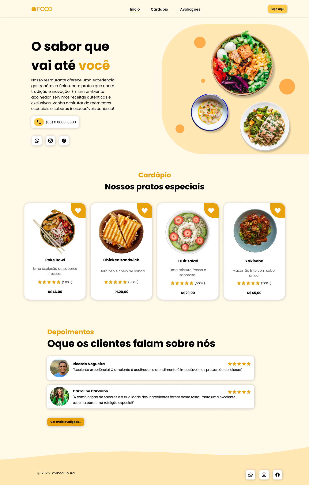
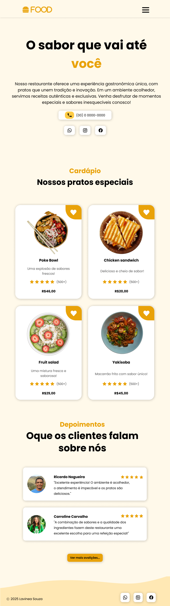
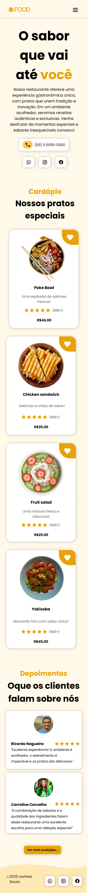

# Restaurante Food - Landing Page

Olá! Eu sou a desenvolvedora responsável pela criação da **landing page do Restaurante Food**. Este projeto foi desenvolvido para apresentar de forma simples e eficaz as informações sobre o restaurante, como o cardápio, promoções e dados de contato. A página foi construída utilizando **HTML**, **CSS** e **JavaScript**.

## Índice

- [Descrição](#descrição)
- [Objetivo do Projeto](#objetivo-do-projeto)
- [Tecnologias Utilizadas](#tecnologias-utilizadas)
- [Como Rodar o Projeto](#como-rodar-o-projeto)
- [Recursos e Funcionalidades](#recursos-e-funcionalidades)
- [Contribuições](#contribuições)
- [Licença](#licença)
- [Contato](#contato)
- [Imagens](#imagens)

## Descrição

Este projeto consiste na **landing page** do **Restaurante Food**, que foi desenvolvida com o objetivo de fornecer uma maneira rápida e fácil para os clientes conhecerem o restaurante, seu cardápio e informações essenciais, como localização e formas de contato.

## Objetivo do Projeto

O objetivo principal desta página é:

- Fornecer uma visão clara e direta sobre o restaurante.
- Apresentar o cardápio e opções de pratos.
- Facilitar a navegação para informações essenciais, como reservas, localização e dados de contato.
- Garantir que a página seja responsiva, ou seja, adaptável a diferentes dispositivos.

## Tecnologias Utilizadas

- **HTML5**: Para a estruturação da página.
- **CSS3**: Para a estilização da página e garantir uma boa experiência visual.
- **JavaScript**: Para funcionalidades interativas, como animações suaves e interações no menu.

## Como Rodar o Projeto

1. **Clone o repositório**:
    ```bash
    git clone https://github.com/devLavinea/restaurante-food.git
    ```

2. **Abra o arquivo `index.html` no seu navegador**:
    O projeto é estático, ou seja, não há necessidade de configuração de servidor ou dependências extras. Basta abrir o arquivo `index.html` no seu navegador de preferência.

## Recursos e Funcionalidades

- **Design Responsivo**: A página foi construída para ser visualmente adaptável em diferentes dispositivos (desktop, tablet, celular).
- **Menu Interativo**: Uma seção com o cardápio, que inclui animações de hover para destacar cada item.
- **Animações e Efeitos**: Utilização de JavaScript para animações simples, como transições suaves ao rolar a página.
- **Links para Redes Sociais**: Conectando o restaurante aos seus perfis em redes sociais (Instagram, Facebook, etc.).

## Contribuições

Se você deseja contribuir com melhorias ou adições ao projeto, siga os seguintes passos:

1. Faça um fork deste repositório.
2. Crie uma branch para sua feature (`git checkout -b feature/nova-feature`).
3. Realize suas alterações e faça commit (`git commit -am 'Adicionando nova feature'`).
4. Envie suas mudanças para o repositório remoto (`git push origin feature/nova-feature`).
5. Abra um pull request para revisão.

## Licença

Este projeto está licenciado sob a Licença MIT - veja o arquivo [LICENSE](LICENSE) para mais detalhes.

## Contato

Caso tenha dúvidas ou sugestões sobre o projeto, pode me encontrar nas seguintes plataformas:

- **Email**: contato@seuemail.com
- **GitHub**: [devLavinea](https://github.com/devLavinea)

## Imagens

Aqui estão algumas capturas de tela do projeto em funcionamento:

### Versão Desktop



### Versão Tablet



### Versão Mobile



---

Obrigado por conferir o meu projeto! 😊 Fique à vontade para sugerir melhorias ou abrir issues caso encontre algo que possa ser melhorado.
