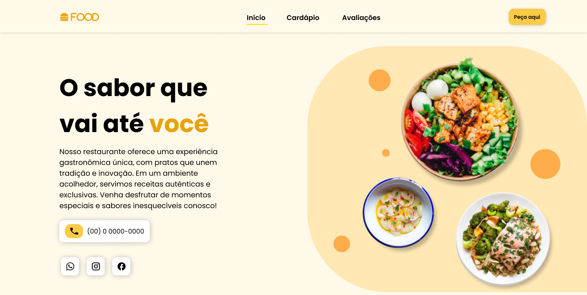

# Restaurante Food - Landing Page



**Desenvolvedora Front-End | HTML, CSS, JavaScript**

Este projeto consiste na criação de uma **landing page** para o **Restaurante Food**. A página foi desenvolvida com o objetivo de fornecer uma experiência de usuário intuitiva, com design responsivo e funcionalidades interativas. Utilizando **HTML**, **CSS** e **JavaScript**, o projeto visa otimizar a navegação e garantir que os usuários encontrem rapidamente as informações sobre o restaurante, como cardápio, promoções e dados de contato.

## Visite o Site

Confira o projeto ao vivo acessando o link abaixo:

[Visite o Restaurante Food](https://restaurantefood.vercel.app/)

## Sobre o Projeto

A landing page foi desenvolvida para apresentar as informações do restaurante de forma clara e envolvente. As principais funcionalidades incluem:

- **Cardápio interativo**: Apresentação de pratos e categorias de forma organizada e atraente.
- **Promoções em destaque**: Exibição de ofertas especiais para atrair a atenção dos usuários.
- **Formulário de contato**: Facilitação da comunicação com os clientes, com um formulário para enviar dúvidas ou realizar reservas.
- **Design Responsivo**: Garantia de que a página seja exibida corretamente em diversos dispositivos (desktop, tablet e celular).

## Tecnologias Utilizadas

Este projeto foi desenvolvido utilizando as seguintes tecnologias:

- **HTML5**: Estruturação do conteúdo e semântica adequada para SEO.
- **CSS3**: Estilização da página, com foco em layout responsivo e experiência visual.
- **JavaScript**: Funcionalidades interativas, como animações de transição suave e interações no menu.
- **Vercel**: Plataforma de hospedagem para garantir desempenho e acessibilidade.

## Como Rodar o Projeto

Para executar o projeto localmente, siga os passos abaixo:

1. **Clone o repositório**:
    ```bash
    git clone https://github.com/devLavinea/restaurante-food.git
    ```

2. **Abra o arquivo `index.html`** no seu navegador.  
   O projeto é estático, então não há necessidade de configuração adicional.

## Funcionalidades

- **Design Responsivo**: A página se adapta automaticamente a diferentes tamanhos de tela utilizando **media queries** e unidades relativas, garantindo uma boa experiência em dispositivos móveis e desktop.
- **Animações com JavaScript**: Animações de transição suave para melhorar a navegação e interatividade na página.
- **Estruturação para SEO**: O HTML foi otimizado para melhorar o desempenho nos motores de busca, incluindo o uso de tags semânticas e meta tags.
- **Links para Redes Sociais**: A página inclui links rápidos para redes sociais do restaurante, conectando diretamente com o público.

## Como Contribuir

Se você quiser colaborar ou sugerir melhorias para o projeto, fique à vontade para seguir os passos abaixo:

1. Faça um fork deste repositório.
2. Crie uma nova branch para sua feature (`git checkout -b feature/nova-feature`).
3. Faça suas alterações e commit (`git commit -am 'Adicionando nova feature'`).
4. Envie suas mudanças para o repositório remoto (`git push origin feature/nova-feature`).
5. Abra um pull request para revisão.

## Licença

Este projeto está licenciado sob a Licença MIT - veja o arquivo [LICENSE](LICENSE) para mais detalhes.

## Contato

Caso tenha dúvidas ou sugestões sobre o projeto, pode me encontrar nas seguintes plataformas:

- **Email**: lavinea2411@gmail.com
- **GitHub**: [devLavinea](https://github.com/devLavinea)

## Imagens

Aqui estão algumas capturas de tela do projeto em funcionamento:

### Versão Desktop


### Versão Tablet


### Versão Mobile


---

Obrigado por conferir o meu projeto! 😊 Fique à vontade para sugerir melhorias ou abrir issues caso encontre algo que possa ser melhorado.
